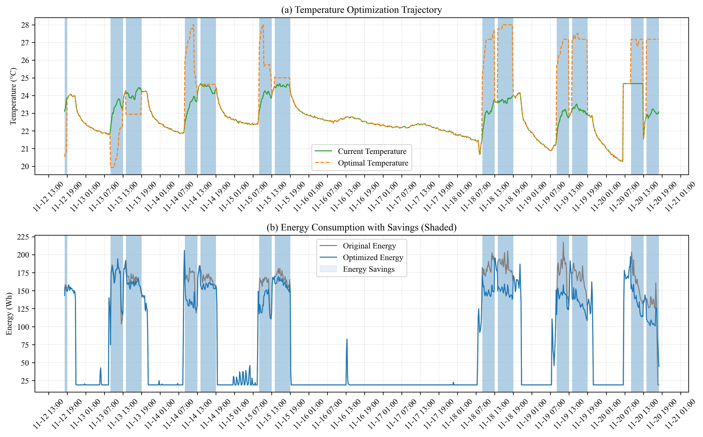

# Heuristic Optimization for Energy-Efficient Office Temperature Control

A behavior-aware heuristic optimization framework for intelligent indoor temperature control in small-to-medium office buildings, built on top of a pre-trained RL-LSTM energy prediction model.

This work is associated with the IEEE conference paper:
> *RL-LSTM and Heuristic Optimization for Energy-Efficient Office Management*  
> ISPDS 2025 (IEEE) | DOI: [10.1109/ISPDS67367.2025.11391185](https://doi.org/10.1109/ISPDS67367.2025.11391185)

---

## Overview

This module takes the output of a pre-trained **RL-LSTM energy prediction model** and determines optimal indoor temperature setpoints through a **multi-objective heuristic scoring function**, balancing:

- **Energy efficiency** — minimize predicted energy consumption
- **Thermal comfort** — maintain PMV within acceptable range ([-0.5, +0.5])
- **Behavioral adaptability** — limit temperature change to ≤ 3°C per cycle

**Key results (9-day validation, Kyushu University office, Nov 12–20, 2024):**

| Period | Original (Wh) | Optimized (Wh) | Savings |
|---|---|---|---|
| Working hours | 53,429.83 | 46,551.88 | **12.87%** |
| Total (all hours) | 87,237.20 | 80,359.25 | **7.88%** |

---

## Optimization Results



Panel (a): Temperature optimization trajectory — green solid line shows current indoor temperature; orange dashed line shows the optimal temperature recommended by the framework during working hours (blue shaded regions).

Panel (b): Energy consumption comparison — gray line shows original consumption; blue line shows optimized consumption; blue shaded areas represent energy savings achieved.

The framework operates **selectively during working hours (09:00–12:00 and 13:00–18:00 JST)**, where occupant behavior most significantly influences energy demand. Temperature adjustments typically range from **0.5–1.0°C per cycle**, ensuring user acceptance while achieving meaningful energy reductions.

---

## Optimization Framework

### Multi-Objective Scoring Function

For each temperature candidate T_i, a composite score is computed:

```
S_total(T_i) = S_energy(T_i) + S_comfort(T_i) + S_stability(T_i)
```

Where:
- **S_energy**: Normalizes RL-LSTM predicted consumption against baseline
- **S_comfort**: Penalizes PMV deviation from thermal neutrality (× 50)
- **S_stability**: Penalizes large temperature changes from previous setpoint (× 20)

The optimal temperature minimizes the total score:
```
T_optimal = argmin S_total(T_i)
```

### Behavioral Constraints
- PMV comfort index maintained within **[-0.5, +0.5]**
- Temperature adjustment bounded to **|ΔT| ≤ 3°C** per control cycle
- Optimization active only during **working hours**; current settings maintained otherwise

### Process Flow
```
Environmental Data (real-time)
        │
        ▼
  Working Hour Check
        │ Yes
        ▼
  Generate Temperature Candidates
  T_i ∈ [T_prev ± 3°C]
        │
        ▼
  For each T_i:
  ├── RL-LSTM → Predicted Energy E(T_i)
  └── PMV Calculator → Comfort Index PMV(T_i)
        │
        ▼
  Multi-Objective Score S_total(T_i)
        │
        ▼
  Select T_optimal = argmin S_total
        │
        ▼
  Output: Optimal Setpoint + Expected Savings
```

---

## Dependencies

This module **requires a pre-trained RL-LSTM model**. Please run the [RL-LSTM repository](https://github.com/wxy0111/rl-lstm-office-energy-prediction) first to generate the model files.

Required model files (saved to `models/` by the RL-LSTM pipeline):
```
models/
├── lstm_model.pth
├── rl_actor.pth
├── rl_critic.pth
├── best_lstm_params.pkl
└── data_scalers.pkl
```

---

## Requirements

```bash
pip install torch pandas numpy scikit-learn matplotlib pythermalcomfort jpholiday pulp openai
```

Python 3.9+ recommended.

---

## Usage

```bash
# 1. Run RL-LSTM training first to generate model files
#    → see https://github.com/wxy0111/rl-lstm-office-energy-prediction

# 2. Set your OpenAI API key in main_heuristic.py
#    OPENAI_API_KEY = "YOUR_OPENAI_API_KEY"

# 3. Run optimization
python main_heuristic.py
```

Output files generated:
- `optimization_results_with_ai.csv` — full optimization results per timestep
- `ai_proposals_*.json` — LLM-generated energy-saving recommendations (if enabled)

---

## File Structure

```
├── main_heuristic.py            # Heuristic optimization + LLM recommendation pipeline
├── lstm_rl_model.py             # Shared model definitions (from RL-LSTM repo)
├── merged_data.csv              # Sensor dataset (Oct–Nov 2024, Kyushu University)
├── optimization_results.png     # Temperature trajectory & energy savings figure
├── models/                      # Pre-trained model weights (from RL-LSTM pipeline)
└── README.md
```

---

## Citation

```bibtex
@inproceedings{wang2025rl,
  title={RL-LSTM and Heuristic Optimization for Energy-Efficient Office Management},
  author={Wang, Xiangyu and Chen, Yutong and Ishibashi, Soichiro and Oh, Jewon and Ueno, Takahiro and Sumiyoshi, Daisuke},
  booktitle={Proceedings of the 6th International Conference on Information Science, Parallel and Distributed Systems (ISPDS 2025)},
  year={2025},
  doi={10.1109/ISPDS67367.2025.11391185}
}
```

---

## Related Work

This repository implements the heuristic optimization module of the broader **BI-TECH** system. For the RL-LSTM prediction module, see:

> **RL-LSTM Energy Prediction** → [github.com/wxy0111/rl-lstm-office-energy-prediction](https://github.com/wxy0111/rl-lstm-office-energy-prediction)

For the full BI-TECH IoT system:

> Y. Chen et al., "BI-Tech: An IoT-Based Behavioral Intervention System for User-Driven Energy Optimization in Commercial Spaces," *IEEE Access*, vol. 13, pp. 166853–166872, 2025. DOI: [10.1109/ACCESS.2025.3607329](https://doi.org/10.1109/ACCESS.2025.3607329)

---

## Author

**Wang Xiangyu (王 翔宇)**  
Doctoral Student, Graduate School of Human-Environment Studies  
Kyushu University, Japan  
wang.xiangyu.425@s.kyushu-u.ac.jp
